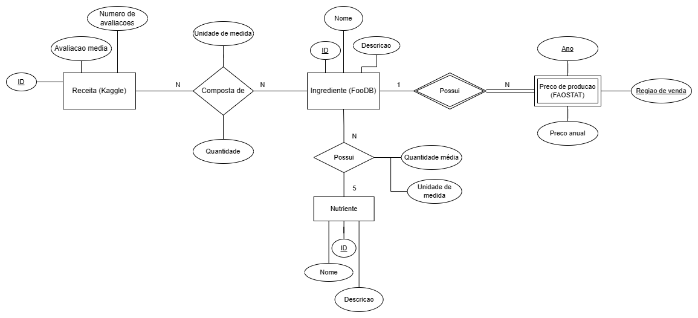

# Slides da Apresentação
[Link para a Apresentação](https://docs.google.com/presentation/d/1kNuzDeh0La-OCHrZmxvyGKZeyDCqgGKv6Llom7XcnzI/edit#slide=id.p21)

# Motivação e Contexto
O projeto apresentado objetiva a união de dados oriundos de 3 bancos distintos para tecer uma análise nova, impossível em uma abordagem individual. Nesse sentido, cada uma das fontes selecionada traz uma visão diferente sobre um mesmo tema, compondo um mosaico multifacetado. A saber, Kaggle contribui com uma abordagem voltada a avaliações qualitativas de receitas, FooDB foca nos aspectos nutricionais quantitativos de ingredientes e FAOSTAT traz uma frente econômica e geográfica. 
Isso permite abordar a complexidade  interdisciplinar da alimentação, contemplando desde culinária até nutrição e geografia.
Através do cruzamento dois bancos de dados citados, é admissível concluir de modo categórigo qual o valor exato (bruto) de cada receita pertencente à "Food Recipes and Interactions" (Kaggle), baseando-se puramente nos ingredientes (alimentos comuns não processados) de sua composição presentes no "FooDB", conjuntamente com as quantias correspondentes; assim, por meio deste será possível a predição do valor bruto da produção de qualquer receita (nova ou ja anteriormente existente) através de informações contidas no "Faostat", bem como uma analise descritiva relativa às tendencias de aumento de preços de ingredientes e receitas em diferentes países ao longo de 2 decádas (1991-2022).

# Bases de Dados
| Titulo | Link | Descrição |
| ------ | ---- | --------- |
| FooDB | https://www.foodb.ca/ | FooDB é uma grande base de dados sobre alimentos, sua química, seus ingredientes e nutrientes. |
| Food Recipes | [https://www.kaggle.com/](https://www.kaggle.com/datasets/shuyangli94/food-com-recipes-and-user-interactions)  | Arquivos com receitas culinárias, incluindo ingredientes e instruções de preparo, além de usuários e avaliações. |
| Faostat | [https://www.fao.org/](https://www.fao.org/faostat/en/#data/PP) | Base de dados mantida pela FAOSTAT, incluindo informações sobre os preços de produção de alimentos pagos pelo setor de agropecuária.|

# Modelo Conceitual


# Modelos Lógicos

```
Recipe(_Food_Code_, Food_Desc, Food_Abbrev_Desc)

Crop_Group(_CGN_, _CGL_, Crop_Group_Description, Is_Vegan)

Ingredient(_FCID_Code_, _Crop_Group_, FCID_Desc, Popularity)
  Crop_Group: chave estrangeira -> Crop_Group

RecipeComposition(_Food_Code_, _FCID_Code_, _Mod_Code_, Ingredient_Order)
  Food_Code: chave estrangeira -> Recipe
  FCID_Code: chave estrangeira -> Ingredient

Nutrient_Values(_Food_Code_, Main food description, Energy (kcal), Carbohydrate (g), Protein (g), Sugars total (g), Total Fat (g), Cholesterol (mg), Fiber total dietary (g), Vitamin A RAE (mcg_RAE), Vitamin B-6 (mg), Vitamin C (mg), Calcium (mg), Iron (mg), Potassium (mg), Sodium (mg), Caffeine (mg), Alcohol (g), Water (g))
  Food_Code: chave estrangeira -> Recipe
```

# Perguntas de Pesquisa/Análise

## Pergunta/Análise 1
* Qual o preço de produção bruto de uma dada receita baseado nos ingredientes e quantidades das quais ela é composta?
  - Usando os dados de preços da FAOSTAT e a análise dos ingredientes da receita com os dados do Food Recipes, será calculado o custo de produção por ingrediente. Os preços podem ser minimizados com base nas regiões globais que cobram o menor custo por cada ingrediente. O preço de produção bruto da receita irá consistir na soma dos preços por ingrediente. 

## Pergunta/Análise 2
* Quais os ingredientes mais comuns em certas receitas e como seus preços têm variado ao longo do tempo? 
  - A análise consistirá em observar a composição de certas receitas, e em seguida, utilizar dados da FAOSTAT para identificar as variações de preço ao longo do tempo.

## Pergunta/Análise 3
* Qual o perfil nutricional das receitas?
  - Com base na análise dos ingredientes que compõem as receitas e na composição nutricional desses ingredientes com os dados do FooDB, é possível construir um perfil nutricional de cada receita. 

## Pergunta/Análise 4
* Quais as receitas mais e menos consumidas? O quão balanceados nutricionalmente são os pratos mais populares?
  - Com base no número de avaliações, é possível fazer uma análise das receitas mais consumidas. Assim, a partir da qualidade das avaliações, será feito um levantamento das receitas favoritas, e uma avaliação de seu perfil nutricional.

# Perguntas/Análise Propostas mas Não Implementadas

## Pergunta/Análise 1
* Como os preços dos alimentos afetam a economia global?
  - Essa pergunta poderá ser respondida combinando os dados das bases utilizadas e outras bases com dados econômicos. 

## Pergunta/Análise 2
* Qual a relação entre as receitas mais populares e a prevalência de doenças relacionadas a dieta em diferentes países?
  - Essa análise pode ser feita considerando as receitas mais consumidas em certos países e dados da prevalência de certas doenças, como obesidade, nessas regiões.

## Pergunta/Análise 3
* Como os preços dos alimentos se relacionam com dados históricos de eventos climáticos?
  - Utilizando dados de preços e dados históricos de eventos climáticos, seria possível analisar como as mudanças climáticas afetam os preços de alimentos.
