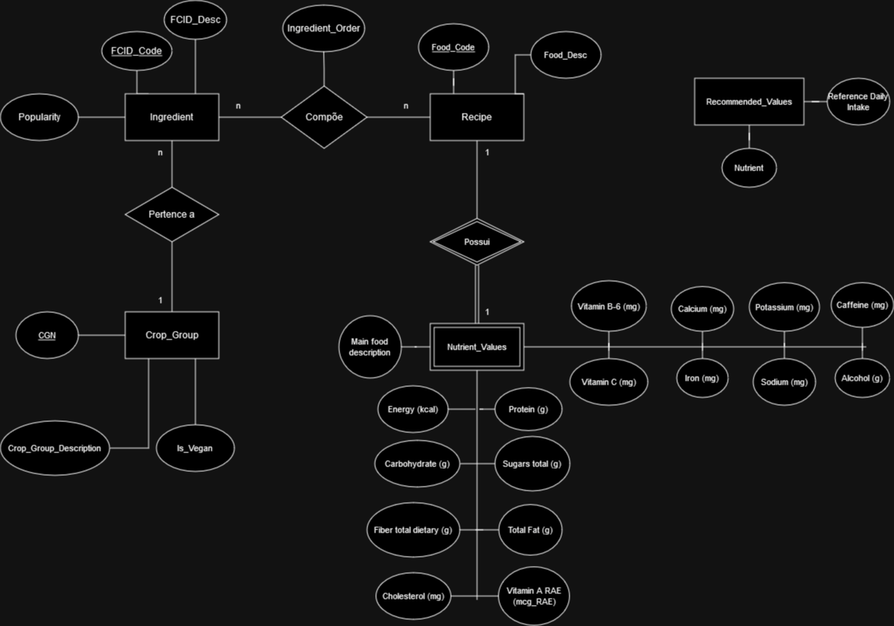
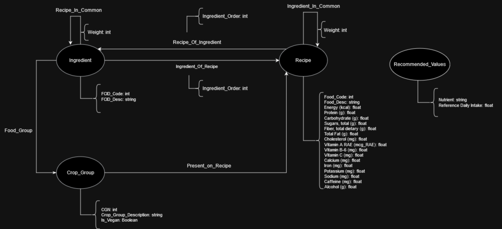
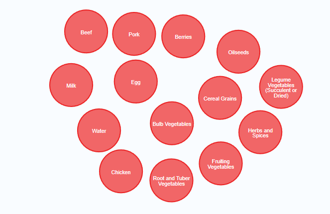
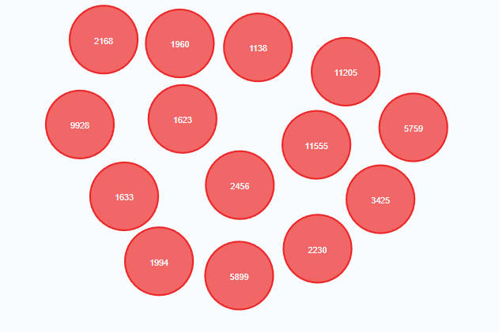

## Motivação e contexto
A segunda versão do projeto traz uma análise que une o poder de bancos de dados relacionais aos baseados em grafos. Por meio dessa conexão e do uso de fontes com diferentes enfoques, tornamos possível uma investigação da complexidade camuflada no cotidiano alimentar. Para nos aprofundarmos nesse trabalho, arquitetamos uma rede de questionamentos que dialogam entre si, construindo passo a passo um painel que explora desde a identificação de relações não triviais entre alimentos até os efeitos que diferentes nichos de consumo posssuem sobre as pessoas. 

## Slides

### Apresentação Prévia
[Slides](slides/MC536%20-%20Projeto%202.pdf)

### Apresentação Final
[Slides](slides/MC536%20-%20Projeto%202.pdf)

## Modelo Conceitual

## Modelos Lógicos

~~~
Recipe(_Food_Code_, Food_Desc)

Crop_Group(_CGN_, Crop_Group_Description, Is_Vegan)

Ingredient(_FCID_Code_, _Crop_Group_, FCID_Desc, Popularity)
  Crop_Group: chave estrangeira -> Crop_Group

Recipe_Composition(_Food_Code_, _FCID_Code_, Ingredient_Order)
  Food_Code: chave estrangeira -> Recipe
  FCID_Code: chave estrangeira -> Ingredient

Nutrient_Values(_Food_Code_, Main food description, Energy (kcal), Carbohydrate (g), Protein (g), Sugars total (g), Total Fat (g), Cholesterol (mg), Fiber total dietary (g), Vitamin A RAE (mcg_RAE), Vitamin B-6 (mg), Vitamin C (mg), Calcium (mg), Iron (mg), Potassium (mg), Sodium (mg), Caffeine (mg), Alcohol (g))
  Food_Code: chave estrangeira -> Recipe

Recommended_Values(Nutrient, Reference Daily Intake)
~~~

## Base de dados

título da base | link | breve descrição
----- | ----- | ----- 
FCID | [Food Commodity Intake Database](https://fcid.foodrisk.org/) | relaciona receitas a seus ingredientes e crop groups
FNDDS | [FNDDS Databases](https://www.ars.usda.gov/northeast-area/beltsville-md-bhnrc/beltsville-human-nutrition-research-center/food-surveys-research-group/docs/fndds-download-databases/) | traz uma vasta análise nutricional de diferentes alimentos

## Detalhamento do Projeto
Nosso projeto conta com dois bancos de dados principais: o FCID e o FNDDS. A escolha deles foi pautada na compatibilidade entre os dois devido à existência de um código em comum que faz a comunicação tanto entre as tabelas internas quanto externas. Nossa análise se divide em dois momentos principais. Inicialmente confrontamos dois rótulos comercializados amplamente: o diet versus o saudável. Fazer a análise do balanceamento de uma receita é possível por meio da consideração de um intervalo nutricional completo, enquanto sua competidora é baseada somente nos aspectos de gordura total, açúcares e sódio. Em um segundo momento, caçamos similaridades imperceptíveis à primeira vista a partir de uma visão fundamentada em grafos, fortemente fundamentada em conceitos de centralidade e comunidade.

## Evolução do projeto
A primeira grande dificuldade encontrada pelo grupo de trabalho foi encontrar bases que tivessem algum tipo de conexão, seja por meio de um ID comum ou por usar a mesma nomenclatura ao se referir aos alimentos. Como encontrar bancos de dado com essas caractérisitcas estava se mostrando muito difícil, começamos a considerar um pré-processamento dos dados armazenados nos arquivos csv. No caso de nomes comuns entre diferentes comidas, encontramos por exemplo um banco que tinha os nomes no plural e outros no singular. A primeira solução foi simplesmente exlcuir o "s" do final de todos os registros. Mas e quanto aos que naturalmente terminam em s? Isso poderia inutilizar grande parte dos dados e não garantiria uma comunicação confiável. Pensamos então em criar um algoritmo que verificasse similaridades entre strings e a partir de uma certa porcentagem de semelhança decidisse que se tratava da mesma comida. Mas e quanto a nomes curtos? A diferença entre "eggs" e "egg" é de apenas uma letra, mas apresenta uma porcentagem muito maior que "eggplant" e "eggplants".  A gota d'água foi quando descobrimos que um deles se referia a porco como pork e o outro como pig... 

Conclusão: fazer esse tipo de ligação seria uma solução deselegante e forçada para o nosso problema, pois seria extremamente restrita não apenas aos bancos de dados que estávamos utilizando naquele contexto como também comprometeria a escalabilidade do código. Se registros novos chegassem, o funcionamento de nossas aplicações estaria fragilizado, pois foi pensado apenas para aquele momento específico do banco.

Seguindo o novo rumo, consideramos inicialmente a junção de 3 bancos de dados distintos, cuidadosamente filtrados para facilitarem a comunicação: FCID, FNDDS e WWEIA. No entanto, conforme analisávamos as potencialidades das diferentes combinações entre eles, percebemos que o terceiro se integrava pouco com o contexto de análise que estávamos buscando, além de tornar a etapa de fusão mais intricada. Isso nos convenceu a reforçar no nosso trabalho um aspecto mais baseado na criação de uma análise robusta, em troca de uma união menos turbulenta dos dados. 

Tendo em mãos todos os ingredientes que utilizaríamos em nossas análises, começamos a combinar as diferentes essências de cada um para dar corpo a nossas querries. No entanto, conforme executamos nossos primeiros testes, percebemos que fazer uma análise de quão balanceada era uma receita poderia ser um imenso desafio. Isso porque contávamos apenas com um valor de referência de consumo ideal, o que nos levava a uma discretização binária na qual um alimento poderia estar acima ou abaixo do ideal. Esse grau de agrupamento impossibilitava a criação de um rank tal qual planejávamos no começo do projeto.
Por causa dessa dificuldade, decidimos seguir por uma abordagem mais adequada às informações à nossa disposição e considerar intervalos dentro dos quais teríamos uma receita balanceada. Nessa seara, reduzimos o grau de discretização e estabelecemos critérios de pontuação que permitiram extrair uma análise mais rica dos dados. 

Quando no contexto da análise feita através da modelagem com grafos de propriedades (com o uso da linguagem Cypher pelo Neo4j), muito cedo deparamo-nos com a impossibilidade de execução de determinadas queries devido à limitações referentes à memória disponível fornecida pelo sistema local; sendo assim, mais concientes desse fator abstrusivo, dedicamo-nos efetivamente a seguir todas as indicações cuja finalidade era atenuar o uso da memória, sendo logo possível a realização das queries. Um exemplo particularmente significativo é a execução de queries dedicados ao criação de novas arestas (relações) entre determinados nós por meio de operações de merge; uma vez que convenientemente separadas e mutuamente distanciadas, as queries finalmente resultaram no que era esperado sem demais entravas.

## Perguntas de Pesquisa/Análise Combinadas e Respectivas Análises
### Perguntas/Análise com Resposta Implementada - SQL
#### [Notebook com resoluções](notebooks/notebook.ipynb)

#### Pergunta/Análise 1

 * Analisar o quão "diet" é uma receita baseado no percentual diario de determinados indicadores nutricionais (gordutas totais/trans, sodio, açucar). Quais as receitas mais diet baseadas nesse critério? E quais possuem maior teor de açúcar, gordura e sódio?

   
   * Primeiro, foi criada uma view estendendo a tabela receitas, adicionando uma nota para essa receita. Essa nota é calculada pela média dos três níveis (nível de gordura, sódio e açúcar), por meio da fórmula:
   **Nivel = (Quantidade do nutriente presente em 100 g da receita)/(Valor recomendado para 100g)**

   ~~~sql
   CREATE VIEW Receitas_Diet AS
               SELECT R.Food_Code, R.Food_Desc, 
               N.Total_Fat/6 AS Nivel_Gordura, N.Sugars_total/15 AS Nivel_Acucar, N.Sodium/600 AS Nivel_Sodio, (N.Total_Fat/6 + N.Sugars_total/15 + N.Sodium/600)/3 AS Nota
               FROM FCID_Food_Code_Description R, FNDDS_Nutrient_Values N
               WHERE R.Food_Code = N.Food_code AND N.Sugars_total/15 > 0.05 AND N.Sodium/600 > 0.05 AND N.Total_Fat/6 > 0.05 AND N.Caffeine = 0 AND N.Alcohol = 0        
               
   ~~~
   Foram desconsideradas receitas contendo cafeína e álcool, bem como as com valores muito insignificantes dos nutrientes usados para essa análise.
   Para calcular a nota, foi tirada uma média entre os indicadores dos três nutrientes, sendo as receitas *diet* aquelas com as menores notas.

   ~~~sql
   SELECT * FROM Receitas_Diet ORDER BY Nota LIMIT 10;

   SELECT Food_Code, Food_Desc, Nivel_Gordura FROM Receitas_Diet ORDER BY Nivel_Gordura DESC LIMIT 10;

   SELECT Food_Code, Food_Desc, Nivel_Acucar FROM Receitas_Diet ORDER BY Nivel_Acucar DESC LIMIT 10;

   SELECT Food_Code, Food_Desc, Nivel_Sodio FROM Receitas_Diet ORDER BY Nivel_Sodio DESC LIMIT 10;
   ~~~
   Os resultados ordenados podem ser observados nas tabelas processadas:
     * [Receitas *diet* ](../data/processed/Pergunta1SQL_Receitas_Diet_Top10.csv)
     * [Receitas com alta gordura](../data/processed/Pergunta1SQL_Receitas_Gordurosas_Top10.csv)
     * [Receitas com alto teor de açúcar](../data/processed/Pergunta1SQL_Receitas_Alto_Acucar_Top10.csv)
     * [Receitas com alto teor de sódio](../data/processed/Pergunta1SQL_Receitas_Alto_Sodio_Top10.csv)

#### Pergunta/Análise 2
 * Analisar o quão balanceada é uma receita com base na quantidade de nutrientes para os quais essa receita possui valores dentro da taxa recomendada, considerando todos os nutrientes do banco (proteínas, carboidratos, vitaminas, etc). Quais as receitas mais balanceadas de acordo com esse critério?
   
   * Foi criada uma view estendendo as receitas, contendo uma coluna para cada um dos nutrientes. Essas colunas possuem valores booleanos (1 caso a receita possua uma quantidade considerada aceitável para aquele nutriente, i.e., entre 5% e 15% do valor diário, e 0 do contrário). Em outras palavras, atribuimos 1 se 
   **(quantidade do nutriente) < 0.15 * (valor diário) AND (quantidade do nutriente)  > 0.05 * (valor diário)**.
   Obs.: a query pra essa view era muito grande então não foi inclusa aqui, mas está presente no notebook.

   Em seguida, criamos outra view contendo agora um atributo nota, dado pela soma das colunas individuais de cada ingrediente. Essa nota define o quão balanceada cada receita é.
   ~~~sql
   CREATE VIEW Receitas_Balanceadas AS
               SELECT R.Food_Code, R.Food_Desc, RG.Energy_level + RG.Protein_level + RG.Carbohydrate_level + RG.Sugars_total_level + RG.Fiber_total_dietary_level + RG.Total_Fat_level + RG.Cholesterol_level + RG.Vitamin_A_RAE_level + RG.Vitamin_B6_level + RG.Vitamin_C_level + RG.Calcium_level + RG.Iron_level + RG.Potassium_level + RG.Sodium_level AS Nota
               FROM FCID_Food_Code_Description R, FNDDS_Nutrient_Values N, Receitas_Grau RG
               WHERE R.Food_Code = N.Food_code AND R.Food_Code = RG.Food_Code;

   SELECT * FROM Receitas_Balanceadas ORDER BY Nota DESC LIMIT 10;
   ~~~
   Os resultados podem ser observados em:
     * [Receitas mais balanceadas](../data/processed/Pergunta2SQL_Receitas_Balanceadas_Top10.csv)

### Perguntas/Análise com Resposta Implementada - Grafos

#### Implementação

~~~cypher
// LOAD: RECOMMENDED VALUES
LOAD CSV WITH HEADERS FROM "https://raw.githubusercontent.com/PietroGolfeto/mc536-grupoVIRUS/main/data/recommended-nutritional-values.csv" AS line
CREATE (:Recommended_Values {Energy_kcal: line.`Energy_(kcal)`, Protein_g: line.`Protein_(g)`, Carbohydrate: line.`Carbohydrate_(g)`, Sugars_total_g: line.`Sugars_total(g)`, Fiber_total_dietary_g: line.`Fiber_total_dietary_(g)`, Total_Fat_g: line.`Total_Fat_(g)`, Cholesterol_mg: line.`Cholesterol_(mg)`,Calcium_mg: line.`Calcium_(mg)`, Iron_mg: line.`Iron(mg)`, Potassium_mg: line.`Potassium_(mg)`, Sodium_mg: line.`Sodium_(mg)`})

// LOAD: INGREDIENT
LOAD CSV WITH HEADERS FROM "https://raw.githubusercontent.com/PietroGolfeto/mc536-grupoVIRUS/main/data/FCID_Code_Description.csv" AS line
CREATE (:Ingredient {FCID_Code: line.FCID_Code, FCID_Desc: line.FCID_Desc})

CREATE INDEX FOR (i:Ingredient) ON (i.FCID_Code)

// LOAD: CROPGROUP
LOAD CSV WITH HEADERS FROM "https://raw.githubusercontent.com/PietroGolfeto/mc536-grupoVIRUS/main/data/FCID_Cropgroup_Description.csv" AS line
#CG auxiliar
CREATE (:CG {CGN: line.CGN, CGL: line.CGL, Description: line.Crop_Group_Description});
    
MATCH (n:CG) WHERE (n.CGN=n.CGL)
CREATE (:Crop_Group {CGN: n.CGN, Crop_Group_Description: n.Description, Is_Vegan: 0});
    
MATCH (n:Crop_Group) WHERE toInteger(n.CGN)<25 OR toInteger(n.CGN)=86
SET n.Is_Vegan = 1
    
MATCH (k:CG) DELETE (k)
    
CREATE INDEX FOR (cg:Crop_Group) on (cg.CGN)

// RELATION: FOOD_GROUP
LOAD CSV WITH HEADERS FROM "https://raw.githubusercontent.com/PietroGolfeto/mc536-grupoVIRUS/main/data/FCID_Code_Description.csv" AS line
MATCH(i:Ingredient {FCID_Code: line.FCID_Code})
MATCH(c:Crop_Group {CGN: line.cgn})
MERGE (i)-[fg:Food_Group]->(c)

// LOAD: RECIPE
LOAD CSV WITH HEADERS FROM "https://raw.githubusercontent.com/PietroGolfeto/mc536-grupoVIRUS/main/data/FNDDS_Nutrient_Values.csv" AS line
CREATE (:Recipe {Food_Code: line.Food_code, Energy_kcal: line.`Energy_(kcal)`, Protein_g: line.`Protein_(g)`, Carbohydrate: line.`Carbohydrate_(g)`, Sugars_total_g: line.`Sugars_total(g)`, Fiber_total_dietary_g: line.`Fiber_total_dietary_(g)`, Total_Fat_g: line.`Total_Fat_(g)`, Cholesterol_mg: line.`Cholesterol_(mg)`,Calcium_mg: line.`Calcium_(mg)`, Iron_mg: line.`Iron(mg)`, Potassium_mg: line.`Potassium_(mg)`, Sodium_mg: line.`Sodium_(mg)`})

LOAD CSV WITH HEADERS FROM "https://raw.githubusercontent.com/PietroGolfeto/mc536-grupoVIRUS/main/data/FCID_Food_Code_Description.csv" AS line
MATCH(r:Recipe {Food_Code: line.Food_Code})
set r.Food_Desc = line.Food_Desc

CREATE INDEX FOR (r:Recipe) ON (r.Food_Code)

// Ingredient_Of_Recipe/Recipe_Of_Ingredient/Present_On_Recipe
LOAD CSV WITH HEADERS FROM "https://raw.githubusercontent.com/PietroGolfeto/mc536-grupoVIRUS/main/data/FCID_Recipes.csv" AS line
MATCH(r:Recipe {Food_Code: line.Food_Code})
MATCH(i:Ingredient {FCID_Code: line.FCID_Code})
MATCH (i)-[fg:Food_Group]->(c:Crop_Group)
MERGE (r)-[ri:Recipe_Of_Ingredient {Ingredient_Order: line.Ingredient_Num}]->(i)
MERGE (i)-[ir: Ingredient_Of_Recipe {Ingredient_Order: line.Ingredient_Num}]->(r)
MERGE (c)-[:Present_On_Recipe]->(r)

// Recipe in Common
MATCH(i1:Ingredient)-[r1:Ingredient_Of_Recipe]->(r:Recipe)<-[r2:Ingredient_Of_Recipe]-(i2:Ingredient)
Merge(i1)<-[ric:Recipe_In_Common]->(i2)
ON CREATE SET ric.weight = 0
ON MATCH SET ric.weight = ric.weight+1
~~~

#### Pergunta/Análise 1
 * Que receitas possuem o maior número relativo de ingredientes compartilhados? Vamos analisar comunidades das receitas e seus nutrientes predominantes para caracterizar elas (grupo dos carbs, proteína etc.).
   
    * Com a finalidade de analisar a inter-relação entre as diferentes receitas com base em sua composição atômica de ingredientes, possibilitando assim uma métrica de paridade e igualdade entre as receitas, fez-se necessário a utilização de queries para buscar as receitas procuradas com base no ingrediente em comum e em seguida juntar as receitas com uma aresta com peso relativo a semelhança entre ambas. As mais similares são logo então retornadas.
    * Desse modo é possível criar comunidades de receitas nas quais a ligação representa uma relação de equivalência, sendo possível avaliar receitas que vão certos conjuntos de ingredientes e iterativamente ir-se trocando um ou mais ingredientes da composição por outros alternativos, mas ainda assim mantendo as propriedades principais da receita original (ao menos até certo ponto)

    ~~~cypher
    MATCH(r1:Recipe)
    MATCH(r2:Recipe)
    WHERE r1.Food_Code <> r2.Food_Code
    MATCH(r1)-[:Recipe_Of_Ingredient]->(:Ingredient)-[:Ingredient_Of_Recipe]->(r2)
    Merge (r1)<-[p:Parity]->(r2)
    ON CREATE SET p.weight = 0
    ON MATCH SET p.weight = p.weight+1

    MATCH x = ()-[p:Parity]->()
    RETURN p 
    ORDER BY p.weight DESC LIMIT 10
    ~~~

#### Pergunta/Análise 2
 * Quais os crop groups mais centrais, com base no número de receitas?
   
   * Foi necessário criar um atributo "Centrality" nos nós que representam os Crop Groups. Assim, sempre que encontrarmos uma Receita que possui um ingrediente de um determinado Crop Group, esse atributo é incrementado. Em seguida, podemos selecionar apenas os nós de Crop Group com uma "Centrality" alta. No exemplo, estão apenas os nós onde a centralidade é maior que 1000.
   ~~~cypher
    MATCH(g:Crop_Group)
    SET g.Centrality = 0

    MATCH(r:Recipe)-[:Recipe_Of_Ingredient]->(i:Ingredient)-[:Food_Group]->(g:Crop_Group)
    MERGE(r)-[x:Has_Group]->(g)
    ON CREATE SET g.Centrality=g.Centrality+1
    ON MATCH SET g.Centrality=g.Centrality+1

    MATCH(g:Crop_Group)
    WHERE g.Centrality>1000
    RETURN g
   ~~~
   Abaixo, estão fotos dos Crop Groups e suas centralidades:
   
   

## Conclusões
Ao tentar fazer a comunicação de bancos de dados que não haviam sido nativamente preparados para isso, apredemos que fazer esse tipo de ligação seria uma solução deselegante e forçada para o nosso problema, pois seria extremamente restrita não apenas aos bancos de dados que estávamos utilizando naquele contexto como também comprometeria a escalabilidade do código. Se registros novos chegassem, o funcionamento de nossas aplicações estaria fragilizado, pois foi pensado apenas para aquele momento específico do banco. Isso fez com que aprendêssemos a de fato pensar não apenas no momento de implementação e nos resultados mais imediatos da pesquisa, mas em sua durabilidade e possível contribuição futuras vistas. 

Além disso, no momento de realmente executar nosssas buscas para criar os diferetes ranks, aprendemos na prática quais os desafios associados à discretização de estados. Ao mesmo tempo que uma discretização alta simplifica o processo e gera um agrupamento maior do objeto de estudo, ela também empobrece os dados disponíveis e pode corromper os resultados. Da primeira vez que realizamos a busca, Gin e Whisky apareceram como algumas das opções mais diet, resultado fruto de como fizemos nossas considerações. Isso nos leva a uma fronteira quase filosófica que questiona o pressuposto de que "números não mentem", pois a depender do tratamento que damos a eles, o resultado pode ser facilmente manipulado para revelar uma condição não condizente com a realidade.

## Resultados e discussão
A partir da análise dos modelos relacionais, chegamos à conclusão de que os alimentos mais diet infelizmente não são os mais balanceados. Esse resultado vem da análise do rank elaborado pela equipe, que salienta a discrepância das duas categorias. Entre os aprofundamentos possíveis do trabalho, poderíamos pensar em elaborar diferentes ranks que dessem maior peso para comidas balanceadas em termos de nutrientes mais importantes para o ser humano. Isso poderia revelar novas interseções com dietas que atendem aos requisitos mais relevantes da alimentação humana.
